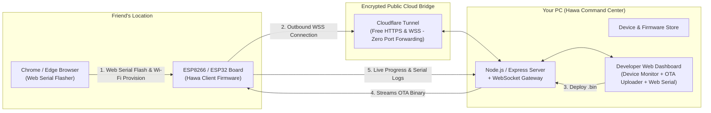

# 🌬️ Project "Hawa" (हावा) — Implementation Plan
**Over-The-Air (OTA) Management & Web Serial Bootstrap Platform for ESP8266 / ESP32**

---

## 1. Executive Summary & Problem Solved

* **The Problem:** Non-technical friends or remote team members struggle with setting up USB-to-UART drivers, Arduino IDE, board packages, libraries, and flashing firmware on ESP8266/ESP32 boards.
* **The Solution ("Hawa"):**
  * **Part 1 (For Your Friends):** A browser-based Web Serial Flasher. They connect their ESP board via USB to Chrome/Edge, enter their local Wi-Fi / hotspot credentials, and flash a pre-configured bootstrap firmware in 1 click.
  * **Part 2 (For You):** A central command dashboard running on your PC. Any registered ESP automatically connects back over a persistent secure WebSocket tunnel. You can drag and drop newly compiled `.bin` files to remotely update any board anywhere in the world and view live serial debug logs in real time.

---

## 2. System Architecture



---

## 3. Communication Protocol Specification

### A. Device Registration & Heartbeat
* **ESP -> Server (`CLIENT_HELLO`):**
  ```json
  {
    "type": "CLIENT_HELLO",
    "deviceId": "hawa-esp32-rohan-01",
    "chip": "ESP32-D0WDQ6",
    "mac": "24:6F:28:XX:XX:XX",
    "ip": "192.168.1.104",
    "rssi": -58,
    "firmwareVersion": "1.0.0",
    "freeHeap": 245120
  }
  ```
* **ESP <-> Server (`PING / PONG`):**
  Sent every 15 seconds to keep the NAT connection alive and refresh signal strength (`rssi`).

### B. Remote OTA Execution
* **Server -> ESP (`OTA_START`):**
  ```json
  {
    "type": "OTA_START",
    "otaId": "ota_98127391",
    "downloadUrl": "https://hawa.yourdomain.com/api/firmware/download/firmware_v1.0.2.bin",
    "size": 892416,
    "md5": "b10a8db164e0754105b7a99be72e3fe5",
    "targetVersion": "1.0.2"
  }
  ```
* **ESP -> Server (`OTA_PROGRESS`):**
  ```json
  {
    "type": "OTA_PROGRESS",
    "otaId": "ota_98127391",
    "percent": 68,
    "bytesRead": 606842,
    "totalBytes": 892416
  }
  ```
* **ESP -> Server (`OTA_COMPLETE`):**
  ```json
  {
    "type": "OTA_COMPLETE",
    "otaId": "ota_98127391",
    "status": "SUCCESS", 
    "message": "Update written successfully. Rebooting in 3 seconds..."
  }
  ```

### C. Live Remote Serial Stream
* **ESP -> Server (`SERIAL_LOG`):**
  ```json
  {
    "type": "SERIAL_LOG",
    "deviceId": "hawa-esp32-rohan-01",
    "timestamp": 1775580000,
    "message": "[SENSOR] DHT22 Temp: 24.8°C | Humidity: 62%\n"
  }
  ```

---

## 4. Planned Project Directory Layout (`d:\HAWA`)

```text
d:\HAWA/
├── package.json
├── server.js                        # Express HTTP + WebSocket Gateway
├── config.js                        # App settings & tunnel config
├── tunnel.js                        # Cloudflare tunnel auto-spawner script
├── public/
│   ├── index.html                   # Developer Admin Dashboard (Your command view)
│   ├── flash.html                   # Client Web Serial Flasher (For your friends)
│   ├── css/
│   │   ├── dashboard.css            # Dark-mode high-performance aesthetic
│   │   └── flasher.css              # Clean, guided step-by-step setup UI
│   ├── js/
│   │   ├── dashboard.js             # Real-time WebSocket state, OTA trigger, serial viewer
│   │   ├── flasher.js               # Web Serial API driver & config injector
│   │   └── esptool-bundle.js        # Bundled esptool-js library
│   └── factory_bins/                # Base bootstrap factory images
│       ├── esp32/
│       │   ├── bootloader.bin
│       │   ├── partitions.bin
│       │   └── hawa_bootstrap_esp32.bin
│       └── esp8266/
│           └── hawa_bootstrap_esp8266.bin
├── firmware/                        # Arduino/ESP-IDF C++ Source Codes
│   ├── HawaAgent_ESP32/
│   │   ├── HawaAgent_ESP32.ino
│   │   ├── HawaConfig.h
│   │   └── HawaOTA.h
│   └── HawaAgent_ESP8266/
│       ├── HawaAgent_ESP8266.ino
│       ├── HawaConfig.h
│       └── HawaOTA.h
└── storage/
    ├── devices.json                 # Device registry & last-known states
    └── uploads/                     # Compiled .bin files uploaded for deployment
```

---

## 5. Phased Implementation Roadmap

### Phase 1: Core Backend & Remote Tunnel Engine
* Setup Node.js backend with Express and `ws` (native WebSocket library).
* Implement in-memory & persistent device registry (`storage/devices.json`).
* Create `/api/firmware/upload` endpoint with multer supporting `.bin` validation.
* Integrate Cloudflare Tunnel runner (`cloudflared`) to automatically generate a zero-config, secure public `https://...` and `wss://...` URL for world-wide reachability without port forwarding.

### Phase 2: ESP Firmware Client (`HawaAgent`)
* Build firmware for **ESP32** (using `Update.h` and `WiFiClientSecure` / `WebSocketsClient`).
* Build firmware for **ESP8266** (using `ESP8266httpUpdate.h`).
* Implement Serial Provisioning protocol:
  * When flashed for the first time, ESP starts in config mode.
  * Listens on Serial at `115200` baud for: `HAWA_CONFIG:{"ssid":"...","pass":"...","token":"..."}`.
  * Stores parameters into persistent NVS/Preferences and restarts into normal mode.
* Implement dual OTA partition rollback on ESP32 (`esp_ota_mark_app_valid_cancel_rollback`). If the newly flashed firmware fails to connect to Wi-Fi within 90 seconds, the chip automatically reverts to the previous working firmware.

### Phase 3: Friend-Facing Web Serial Flasher (`/flash`)
* Integrate Web Serial API with `esptool-js`.
* UI features:
  * Hardware detection (ESP32, ESP8266, ESP32-S3, ESP32-C3).
  * Wi-Fi SSID & Password form with friendly device naming (e.g. `Rohan-ESP32`).
  * One-click "Flash & Connect" button.
  * Real-time flashing progress bar with console log output.
  * Automatic serial handshake to send Wi-Fi credentials straight into NVS upon boot.

### Phase 4: Developer Command Center Dashboard (`/`)
* **Device Management Grid:**
  * Live status pill (Online / Offline / Flashing).
  * Wi-Fi RSSI signal meter, chip type, IP address, and free RAM.
* **Firmware Deployment Studio:**
  * Drag-and-drop `.bin` file upload.
  * Target selection: single device, group, or broadcast.
  * Real-time OTA progress bar (Percentage, download speed, status messages).
* **Remote Web Serial Console:**
  * Interactive terminal view displaying live `Serial.print()` outputs streamed from the remote board over WebSocket.
  * One-click actions: "Remote Restart" and "Test LED Blink".

### Phase 5: Verification & Safety Guardrails
* Binary size and architecture validation before starting OTA (prevents flashing ESP8266 binary to ESP32).
* Network disruption test: ensure ESP resumes or cleanly aborts if Wi-Fi drops midway through OTA without bricking.
* End-to-end documentation & quick-start guide for friends.

---

## 6. Key Advantages & Innovation Points

| Feature | Standard OTA (ArduinoOTA) | Project Hawa |
|---|---|---|
| **Network Reach** | Local LAN only (Same Wi-Fi) | **Global Internet (Anywhere in the world)** |
| **Router Setup** | Requires Port Forwarding | **Zero Config (Outbound WSS via Cloudflare Tunnel)** |
| **Friend Toolchain** | Requires IDE + Drivers + Code | **Zero-Install (Browser Web Serial in Chrome/Edge)** |
| **Debugging** | Must attach USB cable | **Live Remote Serial Console on Web Dashboard** |
| **Safety** | High bricking risk on bad binary | **Dual-Partition Auto-Rollback on Crash** |
